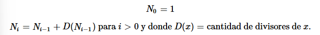

# 📐 Ejercicio 5: Secuencia NuNuDoN

Se define la siguiente secuencia **NuNuDoN** (*N plus Number of Divisors of N*):  



Por lo que los primeros seis términos de dicha secuencia serían: `1, 2, 4, 7, 9, 12`.

El problema entonces es, dados dos valores enteros (A) y (B) ((A < B)), encontrar la cantidad de números de dicha secuencia que se encuentran dentro del rango ([A, B]).

---

## 📤 Input
- La primera línea contiene un entero `N` → número de casos de prueba (≤ 100).
- Cada una de las siguientes `N` líneas contiene dos enteros `A` y `B` (1 ≤ A < B ≤ 100000).

---

## 📥 Output
Para cada caso de prueba, imprimir en una línea la cantidad de números de la secuencia que se encuentran dentro del rango `[A, B]`.

---

## 🧩 Ejemplo

### Input
```bash
3
1 12
1 100
65 70
```

### Output
```bash
6
20
0
```

---

## 🔑 Explicación del ejemplo
Cómo se genera:
- **Empiezaa en 1** -> N_0 = 1
- Busccamos sus divisores: el **1** solo tiene 1 divisor -> D(1) = 1
- Entonces el siguiente número es: <br> `N_1 = 1 + D(1) = 1+1 = 2`
  
Ahora seguimos:
- Para `N_1 = 2`: divisores de 2 son **{1,2}** -> `D(2) = 2` <br> `N_2 = 2 + 2 = 4`
- Para `N_2 = 4`: divisores de 4 son **{1,2,4}** -> `D(4) = 3` <br> `N_1 = 4 + 3 = 7`
- Para `N_3 = 7`: divisores de 7 son **{1,7}** -> `D(7) = 2` <br> `N_1 = 7 + 2 = 9`
- Para `N_4 = 9`: divisores de 9 son **{1,3,9}** -> `D(9) = 3` <br> `N_1 = 9 + 3 = 12`

Entonces los **primeros términos** son: `1, 2, 4, 7, 9, 12`

Demás ejemplos:
- `[1, 12]` → en ese rango están los 6 primeros términos de la secuencia: `1, 2, 4, 7, 9, 12`.
- `[1, 100]` → en ese rango aparecen los primeros 20 términos.
- `[65, 70]` → no hay términos de la secuencia en ese intervalo → resultado = `0`.

---

## 💡 Idea de la solución

- La secuencia se construye de **manera acumulativa**:
    - Se parte de 𝑁_0=1
    - Cada nuevo término se obtiene sumando al anterior la **cantidad de divisores** que tiene.

- Como B ≤ 100000, basta con **precomputar la secuencia una vez hasta superar 100000**.
- Luego, para cada consulta [A, B]:
    - Contar cuántos términos precalculados caen dentro del rango.

De esta forma, se evita recomputar la secuencia en cada caso de prueba, lo que asegura eficiencia.

---

