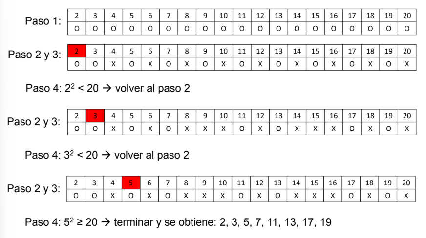

# 📘 Introducción a Algoritmos Ad-hoc

En este módulo estudiaremos los **algoritmos ad-hoc**, junto con problemas clásicos relacionados con divisores, múltiplos, primos y búsqueda de elementos dominantes.

Los algoritmos ad-hoc se caracterizan por estar diseñados para resolver **un problema específico** de forma directa y eficiente, sin necesidad de recurrir a técnicas más generales o complejas como programación dinámica o divide & conquer.

---

## 📚 Temas a tratar

🔹1. [**Cantidad de divisores y Algoritmos ad-hoc**](#-ejemplo-divisores)

🔹2. [**Mínimo común múltiplo y Algoritmo de Euclides**](#-ejemplo-mínimo-común-múltiplo-de-dos-enteros)

🔹3. [**Números primos y Criba de Eratóstenes**](#-ejemplo-números-primos)

🔹4. [**Elemento dominante y Algoritmo Boyer-Moore**](#-ejemplo-elemento-dominante)

---

## 🛠️ Metodologías de solución de problemas computacionales
En la resolución de problemas de programación competitiva y análisis algorítmico existen diferentes metodologías o enfoques:
- **Búsqueda exhaustiva (Brute force):** probar todas las posibilidades.
- **Algoritmos voraces (Greedy):** elegir siempre la mejor opción local en cada paso.
- **Programación dinámica (Dynamic programming):** dividir un problema en subproblemas que se resuelven de forma óptima.
- **Divide y vencerás (Divide & Conquer):** dividir el problema en partes más pequeñas, resolverlas y combinar las soluciones.
- **Algoritmos ad-hoc:** soluciones específicas y directas, diseñadas a medida del problema.

---

## 📊 Ejemplo: divisores
Dado un valor entero positivo `N`, mostrar todos sus divisores diferentes de `1` y `N`.

### 📝 Solución 1 (pseudocódigo)
```bash
read N
for i = 2 to N-1:
    if N % i == 0:
        print i
```

📌 Si `N = 100`, la salida sería:
```bash
2, 4, 5, 10, 20, 25, 50
```

### ⚡ Complejidad
El bucle recorre `N-2` valores, por lo que el número de operaciones es: `f(N) = N - 1`

La complejidad es: `O(N)`

---

### 📝 Solución 2 (pseudocódigo)
```bash
read N
for i = 2 to N//2:
if N % i = 0:
print i
```

📌 Si `N = 100`, la salida sería:
```bash
2, 4, 5, 10, 20, 25, 50
```

### 🚀 ¿Qué cambia respecto a la Solución 1?
En la primera ibas de `2` hasta `N-1`.
Pero piensa:

👉 ¿tiene sentido dividir `N` por un número mayor que `N/2`?

Ejemplo:
- Si `N = 100`, ¿sirve probar `i = 60`? <br>
No, porque `100 / 60 ≈ 1.66`, nunca va a dar un divisor exacto. <br>
El máximo divisor distinto de N siempre está en `N/2`.

Por eso ahora el bucle llega solo hasta `N//2`.

### ⚡ Complejidad
Ahora el bucle va hasta `N/2` en lugar de `N`.
- En Solución 1: ≈ **N operaciones**
- En Solución 2: ≈ **N/2 operaciones**

Matemáticamente: `f(N)= (N/2) −1 +1 =(N/2)`

La complejidad es: `O(N)` (sigue siendo O(N), pero **más eficiente en la práctica** porque hace la mitad de comparaciones.)

---

### 📝 Solución 3 (pseudocódigo)
```bash
read N
for i = 2 to sqrt(N):
    if N % i == 0:
        if i ≠ sqrt(N):
            print(i, N/i)
        else:
            print(i)   
```

📌 Si `N = 100`, la salida sería:
```bash
2, 50, 4, 25, 5, 20, 10
```

### 💡 Cambio clave
En lugar de iterar hasta `N`, el bucle va solo hasta √N.

¿Por qué? Porque los divisores vienen en pares complementarios:
- Si `i` divide a `N`, entonces también `N/i` es divisor.
- Basta con encontrar los menores o iguales a √N, y el complemento lo sacamos con `N/i`.

Ejemplo con `N = 100`:
- Recorres hasta √100 = 10.
- Cuando `i = 2` → imprimes `2` y `100/2 = 50`.
- Cuando `i = 4` → imprimes `4` y `25`.
- Cuando `i = 5` → imprimes `5` y `20`.
- Cuando `i = 10` (justo la raíz) → solo imprimes una vez el 10, no dos.

👉 Así obtienes los divisores con menos iteraciones y sin perder ninguno.

### ⚡ Complejidad
- El bucle ya no recorre `N` ni `N/2`.
- Solo va hasta **√N**.
- Entonces la complejidad es: `O(√N)`

Lo que es muchísimo mejor que `O(N)` cuando `N` es grande. 🚀

---

### 📊 Resumen de las 3 soluciones:

1. For hasta `N-1` → **O(N)**

2. For hasta `N/2` → **O(N)** (mitad de operaciones, pero misma clase)

3. For hasta `√N` → **O(√N)** ✅ la mejor

Matemáticamente: `f(N)= (N/2) −1 +1 =(N/2)`

La complejidad es: `O(N)` (sigue siendo O(N), pero **más eficiente en la práctica** porque hace la mitad de comparaciones.)

---

## 📊 Ejemplo: Mínimo común múltiplo de dos enteros
Dados dos enteros positivos A y B, cuál es el mínimo valor que es múltiplo de ambos

### 📝 Solución 1 (pseudocódigo)
```bash
read A, B
mayor = max(A,B)
menor = min(A,B)

for M = mayor to mayor*menor step mayor:
    if M % menor == 0:
        print M
        break
```

### 🔎 ¿Qué hace?
- Arranca en el mayor de los dos números.
- Va sumando de a "mayor" (step mayor).
- Se detiene cuando encuentra un múltiplo de "menor".
- Ese será el mínimo común múltiplo.

Ejemplo:
- A = 6, B = 4
- mayor = 6, menor = 4
- Probar: 6, 12, 18, 24 → el 12 funciona, porque 12%4 = 0.
- Resultado: mcm = 12 ✅

### ⚡ Complejidad
El ciclo no recorre hasta infinito, sino que como máximo llega hasta: `mayor x menor` <br> *(porque siempre se garantiza que ahí ya estará un múltiplo común)*.

Pero no da cada paso de 1, sino de **"mayor"**.
Es decir, el número de pasos que el bucle hace es: `(mayor x menor) / mayor = menor `

👉 Eso significa que en el peor caso, el ciclo hace menor iteraciones.
👉 La complejidad es: `O(min(A,B)`

---

### 📝 Solución 2 (pseudocódigo + Algoritmo de Euclides)
El algoritmo de Euclides se basa en:
1. Al dividir `M` entre `N`, ambos números enteros, se obtiene un cociente `Q` más un residuo `R`
2. El máximo común divisor de `M` y `N` es igual que el de `N` y `R`
3. A*B = MinimoComunMultiplo(A, B) * MaximoComunDivisor(A, B)

```bash
read A, B
M, N = A, B

while N ≠ 0:
    M, N = N, M%N

MaxCD = M
MinCM= A*B/MaxCD
```

### 📊 Ejemplo:
A es 1043, B es 987 → M = 1043, N = 987

- Iteración 1: M = 987, N = 56 -> *(1043 = 987 × 1 + 56)*
- Iteración 2: M = 56, N = 35
- Iteración 3: M = 35, N = 21
- Iteración 4: M = 21, N = 14
- Iteración 5: M = 14, N = 7
- Iteración 6: M = 7, N = 0 (versus 141 iteraciones de la solución 1)
  
**MinCD** = 1043 * 987 / 7 = **147063**

*Nota:* En Python existen los métodos gcd() y lcm() en la librería math*

### ⚡ Complejidad
- La complejidad del algoritmo es O(log(max(A,B))

---

## 📊 Ejemplo: Números primos
Dado un valor entero N mayor a 1, mostrar todos los números primos menores
o iguales a N
### 📝 Solución 1 (pseudocódigo)
```bash
read N
for i=2 to N
    primo = True
    for j=2 to i-1
        if i % j = 0
            primo = False
    if primo
        print i
```

Ejemplo:

`i = 9`, `j = 3` → `9`
`9` → entonces `9` no es primo.

`i = 7`, `j = 2,3,4,5,6` → nunca da residuo 0 → entonces `7` sí es primo.

### ⚡ Complejidad
Números de operaciones:
- 1 + (N − 1) (1 + (N − 2) ∗ 2 + 1 + 1)
- f(N) = $2N^2$ − 3N+1
- O($N^2$)

---

### 📝 Solución 2 (pseudocódigo)
```bash
read N
for i=2 to N
    primo = True
    for j=2 to √i
        if i % j = 0
            primo = False
    if prime
        print i
```

#### 📊 Ejemplo con 37

- Raíz de 37 ≈ 6.08.
- Solo reviso divisores posibles: `2, 3, 4, 5, 6`.
- No divide entre ninguno → ✅ primo.

En la versión antigua tenía que chequear hasta 36. Mucho más lento.

#### 📊 Ejemplo con 100

- Raíz de 100 = 10.
- Divisores posibles hasta 10: `2, 3, 4, 5, 6, 7, 8, 9, 10`.
- Detecto que 100 % 2 == 0 y ya lo marco como no primo.

En la versión vieja se tenía que chequear hasta 99.

### ⚡ Complejidad
Número de operaciones:
- 1 + 1 + (N − 1) (1 + (√N − 1) ∗ 2 + 1 + 1)
- f(N) = 2N√N + N - 2√N + 1
- O(N^(3/2))

---

### 📝 Solución 3 (Criba de Eratóstenes)
La **Criba de Eratóstenes** es un algoritmo clásico para encontrar todos los números primos hasta un número `N`.  

La idea es ir eliminando (marcando como `False`) todos los múltiplos de cada número primo encontrado, comenzando desde `2`

#### 📌 Pasos del algoritmo
1. Crear una lista con los números del `2` al `N`, todos marcados inicialmente como `True`.
2. Tomar el primer número con valor `True` → es primo.
3. Marcar como `False` todos sus múltiplos, empezando desde su cuadrado.
4. Repetir el proceso con el siguiente número que siga marcado como `True`.
5. El algoritmo termina cuando el cuadrado del número actual es mayor que `N`.
6. Los números que queden en `True` son los primos.

#### 🧮 Ejemplo: N = 20



```bash
func criba(N):
    crear lista primo[2..N] y asignar True a todos
    para i = 2 hasta √N:
        si primo[i] es True:
            para j = i*i hasta N con paso i:
                primo[j] = False
    devolver todos los índices i donde primo[i] = True
```
### ⚡ Complejidad
- Tiempo: `O(N*log(log(N))` → mucho más rápido que probar divisores uno por uno.
- Memoria: `O(N)` → se necesita un arreglo de tamaño `N` para guardar los booleanos.

---

## 📊 Ejemplo: Elemento dominante
Dado un arreglo X con N elementos enteros (aunque se puede extrapolar a otros tipos) determinar cuál, si es que lo hay, aparece más de N/2 veces

Ejemplo: [9, 6, 8, 5, 8, 8, 7, 8, 8]

N=9
N/2 = 4.5 → o sea que el elemento dominante debe aparecer 5 o más veces.

El número `8` aparece 5 veces → ¡es el dominante!
### 📝 Solución 1 (Trivial) (pseudocódigo)
```bash
solucion1(X, N):
    max_conteo = 1                # hasta ahora, el máximo de apariciones es 1
    for i = 0 to N-2:             # recorro cada posición del arreglo
        conteo = 1                # cada elemento aparece al menos 1 vez (él mismo)
        for j = i+1 to N-1:       # comparo contra todos los que están a la derecha
            if Xi = Xj:           # si encuentro un igual
                conteo += 1       # sumo al conteo
        if conteo > max_conteo:   # si este número apareció más veces que el anterior "máximo"
            max_conteo = conteo   # actualizo el máximo
            dominante = Xi        # guardo el número candidato a dominante
    if max_conteo > N/2:          # al final, verifico si en verdad supera N/2
        print dominante           # si sí, lo imprimo
```
#### 📌 Ejemplo trabajado:
1. i = 0 → X[0] = 9
- Comparo con el resto → no hay otro 9.
- `conteo = 1` → no supera el `max_conteo`.

2. i = 1 → X[1] = 6
- Igual, solo un 6.
- `conteo = 1`.

3. i = 2 → X[2] = 8
- Comparo con [5, 8, 8, 7, 8, 8] → aparecen **4 más**.
- `conteo = 5`.
- Ahora `max_conteo = 5`, y el `dominante = 8`.

… y así sigue, pero ya sabemos que ningún otro pasará de 5.

Resultado final → dominante = 8 ✅

### ⚡ Complejidad
- Tiempo: O($N^2$)
- Memoria: `O(1)` (solo usamos unas cuantas variable (`conteo`, `max_conteo`, `dominante`))
  
---

### 📝 Solución 2 (Ordenamiento) (pseudocódigo)
#### 📌 Idea principal
Si ordenamos el arreglo, los elementos **iguales quedan juntos**.

Eso simplifica muchísimo el conteo: ya no necesito comparar cada elemento con todos los demás, sino solo contar cuántas veces seguidas aparece.
```bash
solucion2(X, N):
    X.sort()                        # 1. Ordenar el arreglo
    k, conteo, max_conteo = 0       # k marca el inicio de un grupo de iguales
    for i = 0 to N-1:               # 2. Recorremos el arreglo
        if Xi = Xk:                 # seguimos dentro del mismo grupo
            conteo += 1
            if conteo > max_conteo: # si este grupo es el más largo hasta ahora
                max_conteo = conteo
                dominante = Xi
        else:                       # si cambia el número
            conteo = 0              # reiniciamos el conteo
            k = i+1                 # y actualizamos k al nuevo inicio
    if max_conteo > N/2:            # 3. ¿Se cumple la condición de dominante?
        print dominante
```
#### 📌 Ejemplo trabajado:
Arreglo inicial: [9, 6, 8, 5, 8, 8, 7, 8, 8]

1. Ordenamos: [5, 6, 7, 8, 8, 8, 8, 8, 9]

2. Recorremos contando:
- `5` → aparece 1 vez.
- `6` → aparece 1 vez.
- `7` → aparece 1 vez.
- `8` → aparece 5 veces seguidas → ahora `dominante = 8`.
- `9` → aparece 1 vez.

3. Verificamos:
- max_conteo = 5
- N/2 = 4.5
- 5 > 4.5 -> dominante = 8 ✅

Verificamos:
### ⚡ Complejidad
- Tiempo: `O(N*log(N))`
- Memoria: `O(1)` (Solo unas variables (`conteo`, `max_conteo`, `k`, `dominante`))

---

### 📝 Solución 3 (Diccionario) (pseudocódigo)
```bash
solucion3(X, N):
    d = diccionario
    max_conteo = 1
    for i = 0 to N-1
        if Xi not in d:
            d.add(Xi, 1)
        else:
            d.update(Xi, d.value(Xi)+1)
            if d.value(Xi) > max_conteo
                max_conteo = d.value(Xi)
                dominante = Xi
    if max_conteo > N/2
        print dominante
```
#### 📌 Ejemplo trabajado:
Arreglo: `[9, 6, 8, 5, 8, 8, 7, 8, 8]`

1. Inicio: `d = {}`, `max_conteo = 1`

2. Leo `9` → no está en `d` → `d = {9: 1}`

3. Leo `6` → no está → `d = {9: 1, 6: 1}`

4. Leo `8` → no está → `d = {9: 1, 6: 1, 8: 1}`

5. Leo `5` → no está → `d = {9: 1, 6: 1, 8: 1, 5: 1}`

6. Leo otro `8` → ya está → `d[8] = 2` → `max_conteo = 2, dominante = 8`

7. Leo otro `8` → `d[8] = 3` → `max_conteo = 3`

8. Leo `7` → nuevo → `d = {..., 7: 1}`

9. Leo `8` → `d[8] = 4` → `max_conteo = 4`

10. Leo `8` → `d[8] = 5` → `max_conteo = 5`

Al final: `dominante = 8` porque aparece `5 > 9/2 = 4.5` veces.

### ⚡ Complejidad
- Tiempo: `O(N)` (Recorremos N elementos)
- Memoria: `O(N)` (En el peor caso, todos los elementos son distintos, y el diccionario guarda N claves)
  
---

### 📝 Solución 4 (Algoritmo Boyer-Moore) (pseudocódigo)
```bash
solucion4(X, N):
    conteo = 0
    for i = 0 to N-1
        if conteo = 0              # 1. No tenemos candidato
            conteo = 1             # 2. Tomamos Xi como nuevo candidato
            dominante = Xi
        else if dominante = Xi     # 3. Si Xi coincide con candidato
            conteo += 1            #    sumamos al conteo
        else                       # 4. Si Xi es diferente
            conteo -= 1            #    le restamos "fuerza" al candidato
    
    # 5. Verificación final (por si no había dominante)
    max_conteo = 0
    for i = 0 to N-1
        if Xi = dominante
            max_conteo += 1
    
    if max_conteo > N/2
        print dominante
```
#### 📌 Ejemplo trabajado:
Arreglo: `[9, 6, 8, 5, 8, 8, 7, 8, 8]`

1. Inicio: `conteo = 0`

2. Leo `9`: como `conteo=0`, candidato = `9`, conteo=1

3. Leo `6`: diferente → conteo=0

4. Leo `8`: conteo=0 → candidato=`8`, conteo=1

5. Leo `5`: diferente → conteo=0

6. Leo `8`: conteo=0 → candidato=`8`, conteo=1

7. Leo `8`: igual a candidato → conteo=2

8. Leo `7`: diferente → conteo=1

9. Leo `8`: igual a candidato → conteo=2

10. Leo `8`: igual a candidato → conteo=3

👉 El algoritmo propone `8` como candidato.

Ahora verificamos en la **segunda pasada**:
`8` aparece 5 veces de 9 → sí es dominante.

### ⚡ Complejidad
- Tiempo: `O(N)` 
- Memoria: `O(1)` (Solo unas variables (`conteo` y `dominante`))

---

### 📊 Comparación de soluciones (Elemento dominante)

| Solución | Idea principal                                    | Tiempo       | Memoria |
|----------|---------------------------------------------------|--------------|---------|
| 1️⃣ Trivial     | Contar ocurrencias de cada elemento con doble `for` | O(N²)        | O(1)    |
| 2️⃣ Ordenamiento | Ordenar el arreglo y contar elementos iguales seguidos | O(N log N)   | O(1)    |
| 3️⃣ Diccionario  | Usar hash/diccionario para contar ocurrencias        | O(N)         | O(N)    |
| 4️⃣ Boyer-Moore  | Ir “eliminando pares” hasta hallar un candidato      | O(N)         | O(1)    |

---
